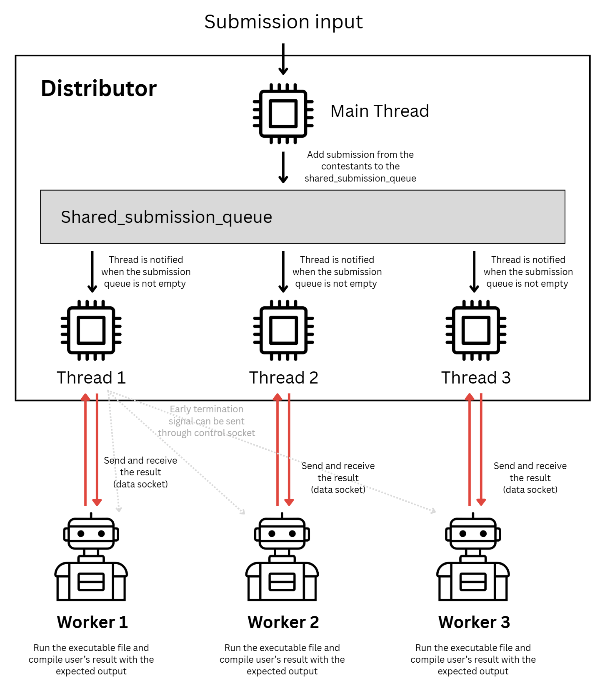
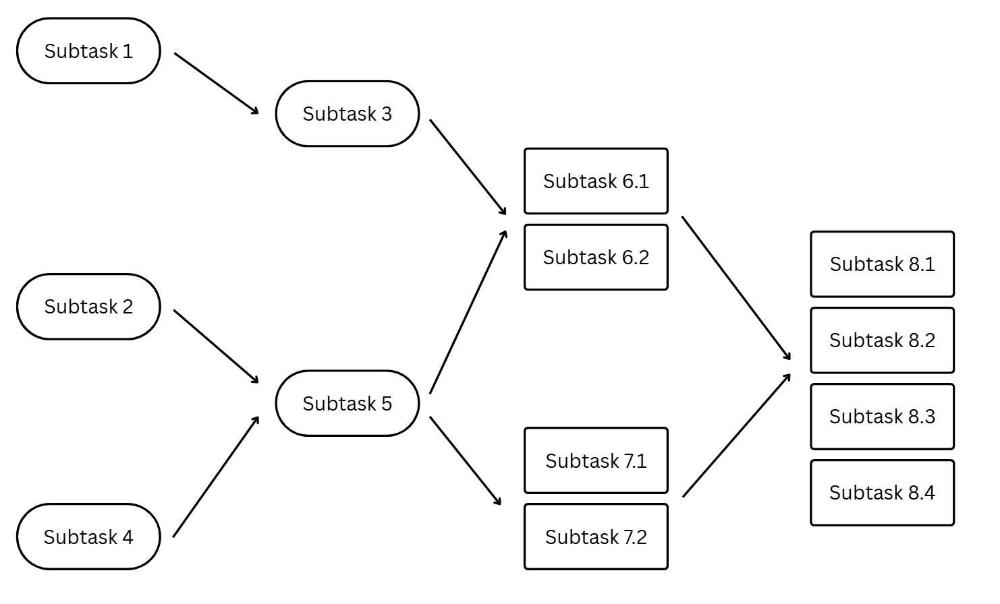

# Distributed Judge System for OI-Style Contests

[➡️ **How to Use This Project**](#how-to-use-this-project)

## Introduction
OI-style contests are a type of competitive programming competition, such as IOI and APIO.
In OI-style contests, contestants are given a set of problems (typically 3-4 problems per contest).
Each problem contains several subtasks, which are essentially subproblems with different constraints.
Each subtask is worth a certain number of points, and a contestant's score is the sum of points from all subtasks they solve.
Each subtask has different test cases, most of which are independent of each other.
In this type of competition, worker judges evaluate contestants' submissions by running the code and
checking whether the contestant's output matches the expected output.

## Abstract
This project implements a sample distributed judge system for OI-style contests designed to **reduce evaluation time through intelligent parallelization**. Traditional sequential judging systems process submissions one test case at a time, leading to long wait times, especially for large test cases. Our system addresses this bottleneck by judging contestants' submissions in a distributed manner using adaptive strategies based on several factors including available workers, expected test case execution time and size, dependency relationships between subtasks, and early termination opportunities.

# System Architecture & Workflow

<p align="center">

</p>


## Multi-Threaded Pattern

Our system uses a **shared queue architecture** with one main thread and multiple worker threads to achieve efficient parallel processing.

### Main Thread
- **Role**: Receives submission inputs and manages the evaluation pipeline
- **Function**: Adds submissions from contestants to the `shared_submission_queue`
- **Coordination**: Notifies worker threads when new submissions are available

### Worker Threads
- **Activation**: Threads sleep until notified that the submission queue is not empty
- **Processing**: Each thread pulls submissions from the queue and distributes tasks to available workers
- **Concurrency**: Multiple threads (Thread 1, 2, 3, ...) operate simultaneously, maximizing throughput

### Communication with Workers

Each thread maintains **bidirectional communication** with its assigned worker:

- **Data Socket** (Red arrows): Send evaluation tasks and receive results
  - Thread sends: Submission code, test cases, expected outputs
  - Worker executes: Runs the executable and compares user's result with expected output
  - Thread receives: Pass/fail status, execution time, memory usage

- **Control Socket** (Gray dotted arrows): Send early termination signals
  - Enables immediate cancellation of ongoing evaluations when dependencies fail
  - Prevents wasted computation on already-failed submission branches

This architecture ensures **maximum parallelism** while maintaining clean separation of concerns between coordination (threads) and execution (workers).


# Submission Distribution Strategy

<p align="center">

</p>

## Core Approach: Intelligent Parallelism

Our distributor employs **two-level parallelism** to maximize concurrency:

### External Parallelism (Between Subtasks)
- **Strategy**: Multiple independent subtasks execute **concurrently** across different workers
- **Example**: Subtask 1, 2, and 4 can all run in parallel on different workers simultaneously

### Internal Parallelism (Within Large Subtasks)
- **Strategy**: Split test cases of large subtasks and distribute across multiple workers
- **Example**: Subtask 6.1 and 6.2 run simultaneously on different workers, both contributing to Subtask 6's evaluation
- **Benefit**: Heavy computational tasks are parallelized internally, reducing bottlenecks

#### Why Keep Small Subtasks Unified?

We don't apply internal parallelism to small subtasks because the **communication overhead outweighs the benefits**. Splitting small tasks requires multiple send/receive operations that can exceed the actual evaluation time. Additionally, broadcasting early termination signals to multiple workers adds unnecessary latency and complexity. In contrast, large subtasks justify the parallelization investment since: (1) they're only reached after basic correctness is validated, indicating higher success probability, and (2) their long execution time makes communication overhead negligible by comparison.

### Executable File LRU Cache

**Strategy**: When workers process multiple test cases from the same submission, repeatedly transferring identical executables wastes bandwidth and time. To address this, each worker maintains an LRU cache indexed by submission ID. On first contact with a submission, the executable is cached locally. Subsequent test cases retrieve the cached file instantly, eliminating redundant transfers. The LRU eviction policy automatically manages memory by removing least-recently-used entries when capacity is reached.


## Dependency-Aware Execution: Smart Concurrency Control

### Topological Sorting for Maximum Parallelism

We analyze the dependency graph to identify which subtasks can run **concurrently**:

```
Independent Groups (run in parallel):
  Wave 1: Subtask 1, 2, 4          ← All execute simultaneously
  Wave 2: Subtask 3, 5              ← Triggered when dependencies complete
  Wave 3: Subtask 6.1, 6.2, 7.1, 7.2 ← Maximum parallelism here!
  Wave 4: Subtask 8.1, 8.2, 8.3, 8.4 ← All concurrent
```

### Key Principles

1. **No Waiting on Independent Tasks**: Unlike sequential judging, subtasks without dependencies start immediately
2. **Cascading Execution**: As soon as a subtask completes, all dependent subtasks that are now ready launch in parallel
3. **Maximum Worker Utilization**: Workers are never idle if there are evaluable subtasks in the queue

### Early Termination with Parallel Awareness

**Critical Feature**: If any subtask fails, we immediately:
- Cancel all in-flight evaluations of dependent subtasks
- Skip queued dependent subtasks entirely
- Continue evaluating independent subtask branches

**Example Scenario:**
```
If Subtask 3 fails:
  ✗ Cancel: Subtask 6.1, 6.2, 8.x (all depend on 3)
  ✓ Continue: Subtask 5, 7.1, 7.2 (independent path through Subtask 2)
```

# How to Use This Project

## Prerequisites

1. **C++ Compiler**: G++ compiler with C++17 support or higher
2. **Build System**: GNU Make
3. **Dependencies**: 
   - [nlohmann/json](https://github.com/nlohmann/json) library for JSON parsing.

## Installation

1. **Clone the repository**:
   ```bash
   git clone 
   cd distributed-judge-system
   ```

2. **Install dependencies**:
   - Download and include `nlohmann/json` header in your include path
   - Or install via package manager (e.g., `apt install nlohmann-json3-dev`) (recommended)

3. **Build the project**:
   ```bash
   make
   ```

## Configuration

### Testcase Setup

Before running the system, prepare your testcase files:

1. **Directory Structure**: Create testcase folders for each problem
   ```
   testcase_problem1/
   ├── 00_01.in
   ├── 00_01.out
   ├── 01_01.in
   ├── 01_01.out
   ├── 01_02.in
   ├── 01_02.out
   ...
   ```

2. **Naming Convention**: Files must follow the pattern `{subtask_id}_{testcase_id}.{in|out}`
   - **Important**: Indexing starts from 0
   - Example: `00_01.in` = Subtask 0, Test case 1
   - Example: `02_03.out` = Subtask 2, Test case 3, expected output

3. **Configuration File** (`testcase_config.json`):
  The configuration file should be in this following format:
   ```json
   {
     "tasks": [
       {
         "task_id": 0,
         "memory_limit": 1024000,
         "time_limit": 2000,
         "subtasks": [
           {
             "subtask_id": 0,
             "mod": 1,
             "dependencies": []
           },
           {
             "subtask_id": 1,
             "mod": 1,
             "dependencies": [0]
           },
           {
             "subtask_id": 2,
             "mod": 1,
             "dependencies": [0, 1]
           },
           {
             "subtask_id": 3,
             "mod": 1,
             "dependencies": [0, 1]
           },
           {
             "subtask_id": 4,
             "mod": 2,
             "dependencies": [0, 1 ,3]
           },
           {
             "subtask_id": 5,
             "mod": 4,
             "dependencies": [0, 1, 2, 3, 4]
           }
         ]
       },
       {
        more tasks...
       },
       more tasks...
     ]
   }
   ```
   
   **Configuration Fields in `testcase_config.json`:**
   - `task_id`: Problem identifier
   - `memory_limit`: Memory limit in KB
   - `time_limit`: Time limit in milliseconds
   - `subtask_id`: Subtask identifier (must match testcase file prefix)
   - `mod`: Number of workers to parallelize this subtask across (internal parallelism)
   - `dependencies`: Array of subtask IDs that must pass before this subtask runs

### Worker and Distributor Setup

You can customize the worker and distributor configuration by editing [`main_worker.cpp`](main_worker.cpp) and [`main_distributor.cpp`](main_distributor.cpp) respectively.

## Running the System

**Important**: Always start workers before starting the distributor.

### 1. Start Workers (on each worker machine)

```bash
# First run - download testcases
./worker <port> -tc

# Subsequent runs - use stored testcases
./worker <port>

# Example:
./worker 8500 -tc
```

### 2. Start Distributor (on coordinator machine)

```bash
./distributor
```

The distributor will:
- Connect to all configured workers
- Load task configurations and testcase metadata
- Process submissions according to the distribution strategy
- Output results to the specified log file

## Integration with Existing Grader Systems

This system can be integrated into web-based grading platforms by modifying `add_submission()` to accept frontend requests, routing evaluation logs to a database instead of files, and processing worker results for user-facing display.